# 图片

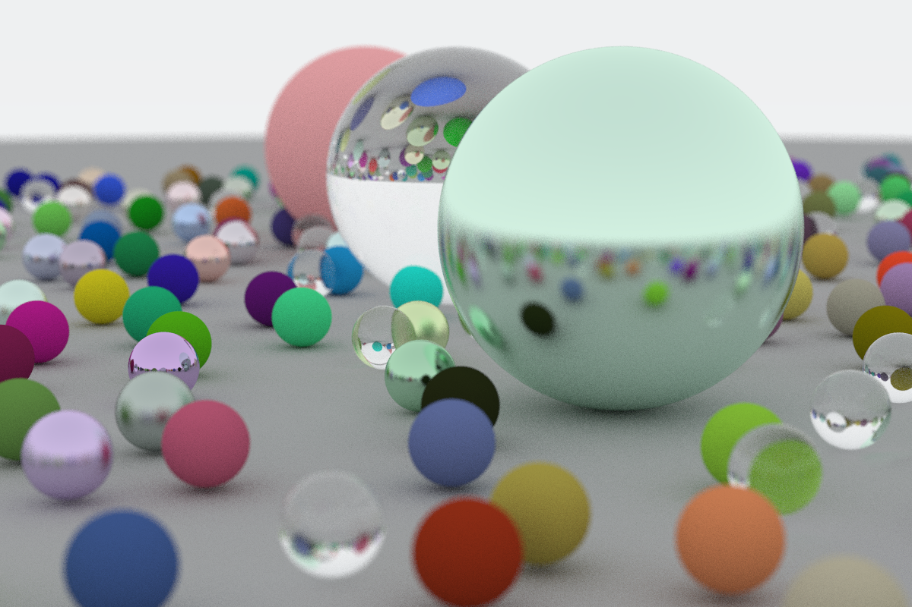

## 2.3 hello world

## 4 Rays, a Simple Camera, and Background

### Quadratic function

### Sine function

### Tangent function

### Inverse proportional function

## 5 Adding a Sphere

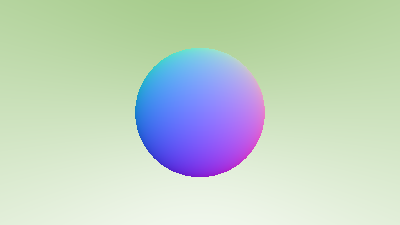

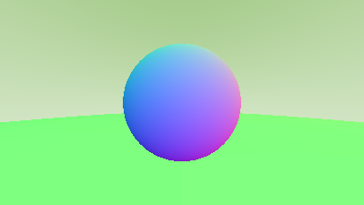

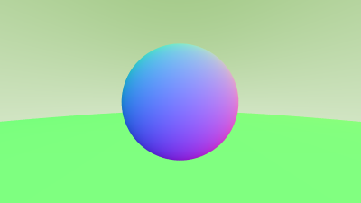

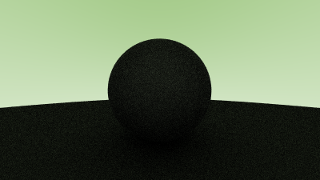

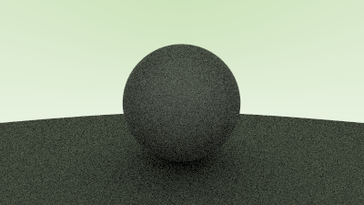

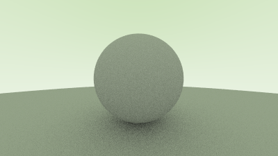

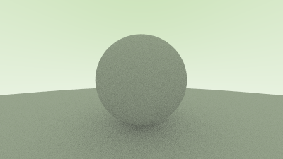

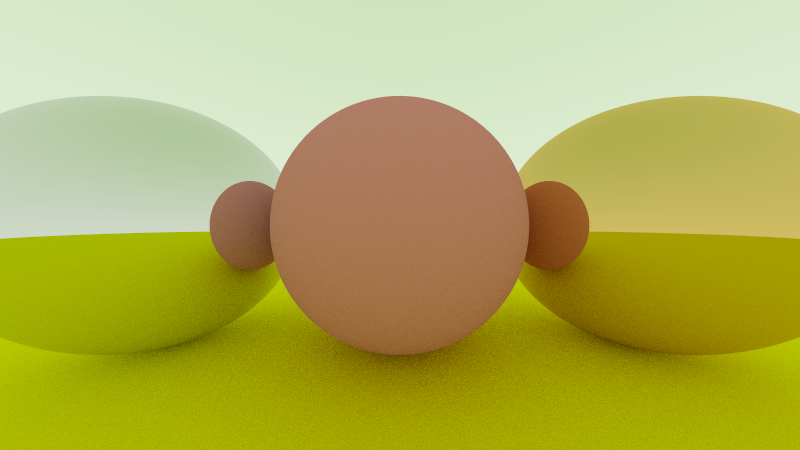

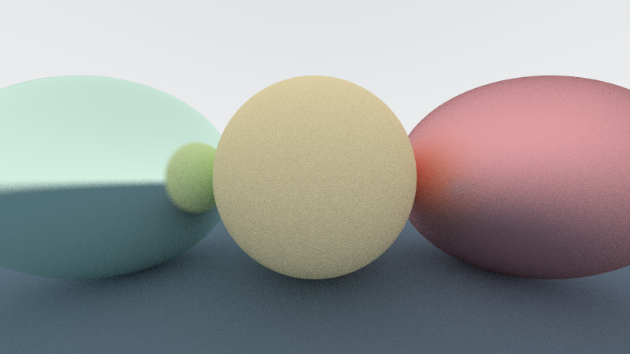

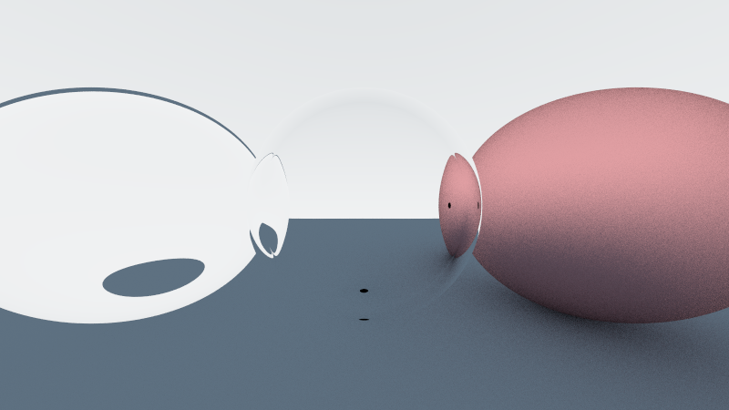

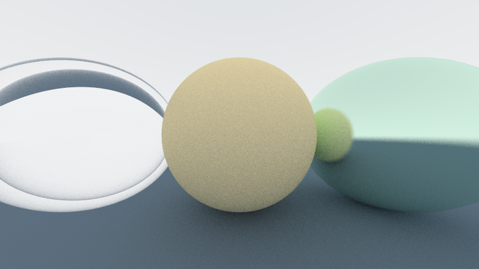

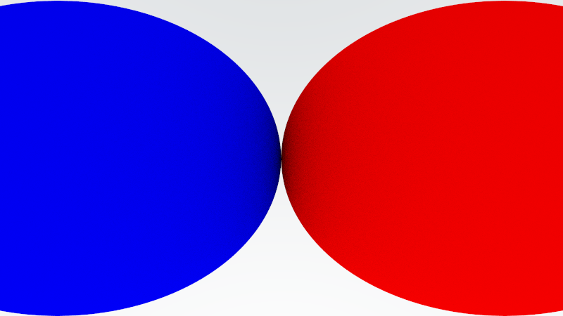

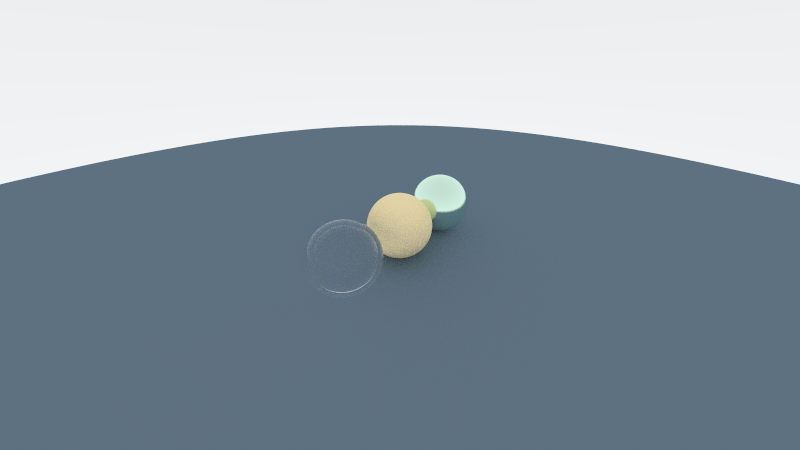

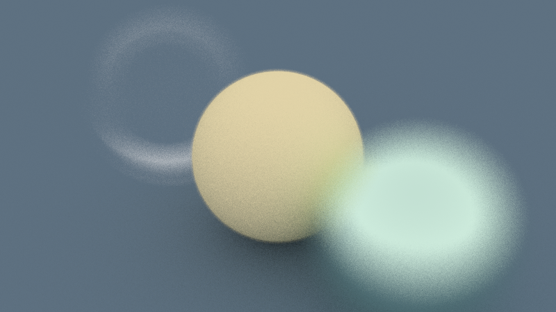

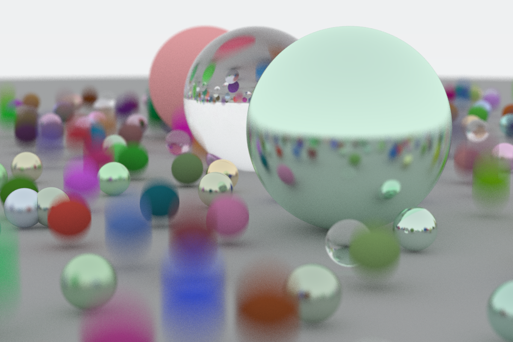

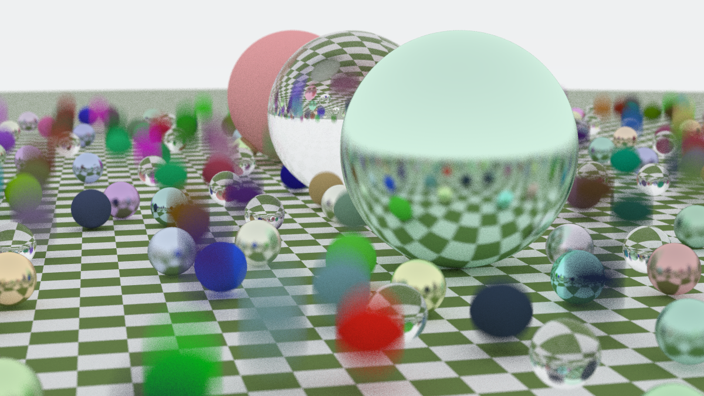

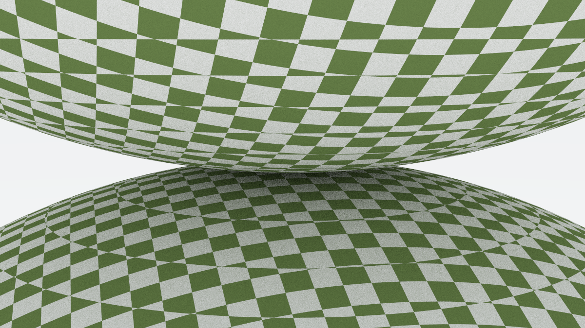

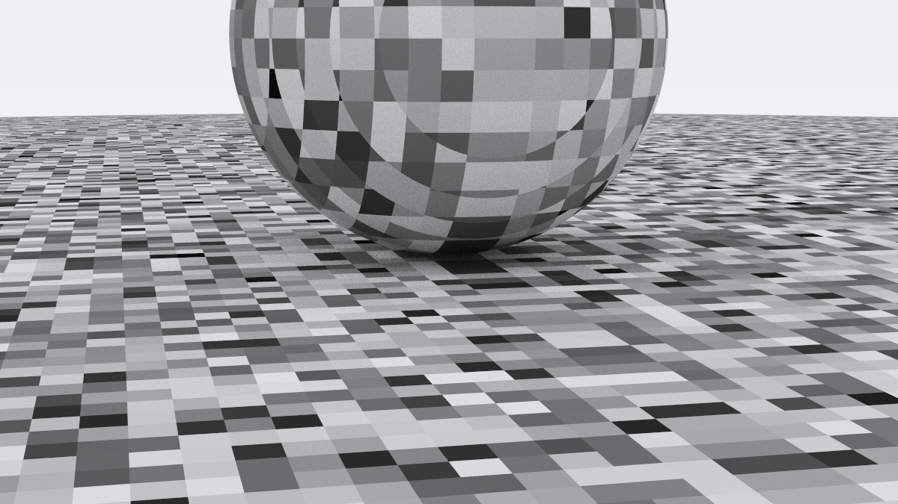

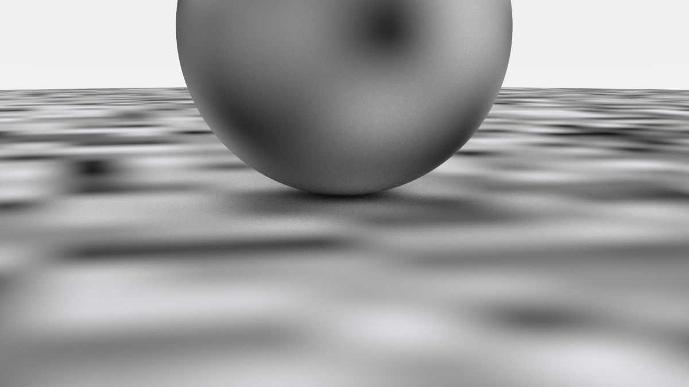

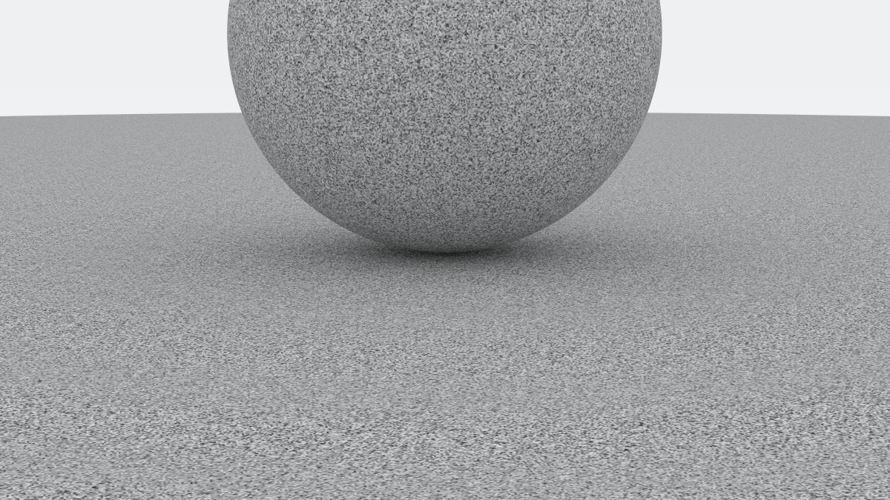

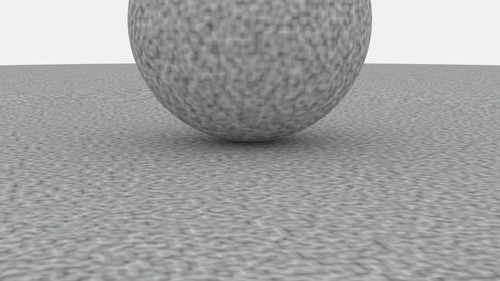

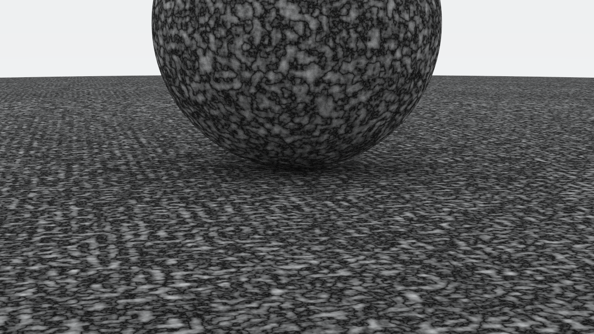

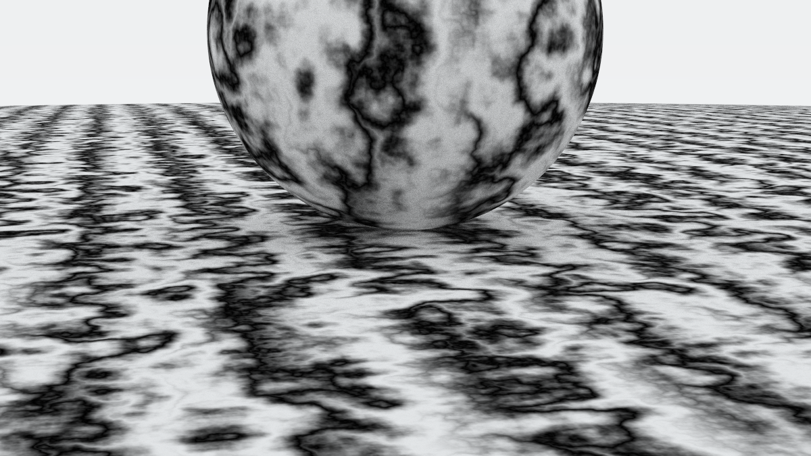

.png)